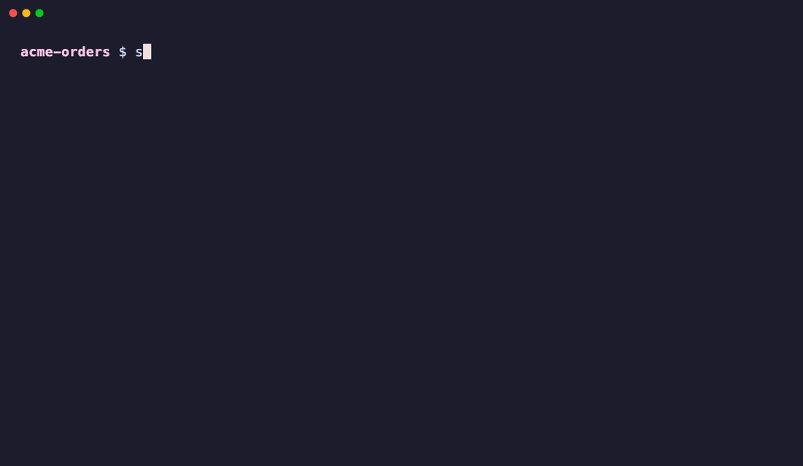

<div align="center">


# Sentinel

**One command that decides whether a code change is acceptable, for humans and AI coding agents.**

[](https://github.com/RicardoRB/sentinel-ai/releases)
[](https://github.com/RicardoRB/sentinel-ai/actions/workflows/release.yml)
[](https://ricardorb.github.io/sentinel-ai/)
[](#development)

[](#license)

[Documentation](https://ricardorb.github.io/sentinel-ai/) ·
[Quick start](#-quick-start) ·
[Configuration](#%EF%B8%8F-configuration) ·
[CI/CD](#-cicd) ·
[Report a bug](https://github.com/RicardoRB/sentinel-ai/issues)

</div>

---

Sentinel is a **quality-gate orchestrator for Java projects**. Declare your checks once in
`sentinel.toml` (tests, coverage, PMD, Checkstyle, SpotBugs, ArchUnit, security scanners, or any
command), and Sentinel runs them all, reports one verdict, and exits with a code your CI or AI agent
can act on.

<p align="center">
  
  <br>
  <sub>A failing Checkstyle gate, a one-line fix, and a passing quality gate. (<a href=".github/assets/sentinel-demo.webm">WebM version</a>)</sub>
</p>

## 🎯 Why Sentinel?

**The problem.** A healthy Java project runs half a dozen quality tools, each with its own command,
output format, and failure semantics. People forget to run them, and AI coding agents don't know
they exist. Agents also generate code faster than anyone can review it, so changes that break
tests, style, or architecture often reach review before anyone notices.

**Who it's for:**

- Teams using **AI coding agents** (Claude Code, OpenCode, or any CLI agent) who want every edit
  checked automatically.
- Java/Maven teams who want **one quality gate** locally and in CI, instead of a pile of scripts.
- Tech leads who want an opinionated **`standard` or `strict` baseline** without configuring each
  tool by hand.

**Why not just run PMD, Checkstyle, and Sonar directly?** Sentinel doesn't replace those tools. It
**orchestrates** them:

| Running tools individually | With Sentinel |
|---|---|
| N commands, N output formats, N exit-code conventions | `sentinel check`: one report, one exit code |
| Each plugin configured by hand in `pom.xml` | `sentinel init --preset strict` adds plugins and rule files |
| Agents don't know which checks exist | Hooks run checks after **every** agent edit and return failures to the agent |
| Output parsed with ad-hoc scripts | Stable JSON schema on stdout, diagnostics on stderr |
| Same failure, same mistake, again and again | Learning mode asks the agent to write a preventive rule in `AGENTS.md` |

**Main differentiator:** Sentinel is designed for the **agent feedback loop**. It is a fast native
binary that agents call after each write and whose machine-readable verdict they can fix against.

## ✨ Features

| | |
|---|---|
| 🔎 **Static analysis** | PMD, SpotBugs, SonarQube, Semgrep |
| 🎨 **Code style** | Checkstyle, Spotless / google-java-format |
| 🏛️ **Architecture checks** | ArchUnit (generated Layered, Hexagonal, or Clean test), Maven Enforcer |
| 🔐 **Security checks** | Gitleaks, OWASP Dependency-Check, Trivy, Semgrep, OWASP ZAP (DAST) |
| 🚦 **Quality gates** | Compile, tests, JaCoCo coverage, PIT mutation testing, license, API compatibility, custom commands |
| ⚙️ **CI/CD support** | Deterministic [exit codes](#exit-codes), JSON reports, profiles (`default`, `ci`, …), `--fail-fast` |
| ⚡ **Native executable** | GraalVM native binaries start instantly with no JVM, which suits per-edit hooks |
| 🤖 **Integrations** | Claude Code and OpenCode edit/write hooks; `sentinel loop` for any CLI agent |
| 📄 **Output formats** | Human-readable text (live progress, `NO_COLOR` aware) and JSON (schema v1) |

## 🚀 Quick Start

### Requirements

- A **Java/Maven** project (Maven Wrapper recommended).
- The **native binary** (no JVM needed), or **JDK 25** to run `sentinel.jar`.
- Any standalone tools you enable, such as `gitleaks`, `semgrep`, or `trivy`, must be on your
  `PATH`. Sentinel never installs tools.

### 1. Install (≈30 seconds)

```bash
curl -fsSL https://raw.githubusercontent.com/RicardoRB/sentinel-ai/main/install.sh | sh
sentinel --version
```

The script detects your OS and CPU, downloads the matching native binary from GitHub Releases,
verifies its SHA-256 checksum, and installs it to `~/.local/bin`. For Windows, manual downloads, and
source builds, see [Distribution](#-distribution).

### 2. Initialize your project

```bash
cd your-maven-project
sentinel init                       # interactive wizard: preset, gates, agent integration
sentinel init --preset standard     # non-interactive: low-noise baseline
sentinel init --preset strict       # non-interactive: stricter thresholds + ArchUnit, Enforcer, PIT
```

`init` writes `sentinel.toml`, adds any missing Maven plugins to `pom.xml`, and writes rule files to
`config/`. If any step fails, it rolls back every change. Example output:

```text
Created /path/to/your-maven-project/sentinel.toml
Updated pom.xml with Maven tools:
- maven-checkstyle-plugin
- maven-pmd-plugin
- spotbugs-maven-plugin
- jacoco-maven-plugin
- spotless-maven-plugin
No agent integration installed.
```

### 3. Run your first analysis

```bash
sentinel check                 # human-readable report
sentinel check --format json   # machine-readable report
```

> The analysis command is `sentinel check`. There is no separate `analyze` command.

Expected output on success:

```text
Sentinel 0.0.1

✓ compile
✓ tests
✓ format
✓ Checkstyle
✓ PMD
✓ SpotBugs
✓ coverage

Quality Gate: PASSED
7 passed · 0 failed · 0 skipped
```

If something isn't working, run `sentinel doctor`:

```text
[OK] project       /path/to/your-maven-project
[OK] maven         Maven Wrapper available.
[OK] configuration Configuration is present.
[WARNING] integration   OpenCode integration not configured.
```

## ⚙️ Configuration

**Location:** `sentinel.toml` at the project root. Sentinel also finds it from any subdirectory,
and `-C <dir>` lets you point at another project.

**Minimal configuration:**

```toml
version = 1

[quality-gates.tests]
command = "./mvnw test"
```

**A more complete example:**

```toml
version = 1
preset = "standard"   # informational

[quality-gates.compile]
command = "./mvnw compile"

[quality-gates.tests]
command = ["./mvnw", "test"]

[quality-gates.spotbugs]
command = "./mvnw spotbugs:check"
enabled = false       # disable a check without deleting it

[quality-gates.gitleaks]
command = ["gitleaks", "detect", "--redact"]
profiles = ["ci"]     # run only with: sentinel check --profile ci
```

### Presets

| Preset | Gates | Thresholds |
|---|---|---|
| `standard` | compile, tests, format, Checkstyle, PMD, SpotBugs, coverage | 70% line coverage |
| `strict` | `standard` + ArchUnit, Maven Enforcer, PIT mutation testing | 85% line, 75% branch, 60% mutation |
| `custom` (wizard) | Nothing preselected; you choose | — |

`--gate <id>` adds gates on top of a preset, for example
`sentinel init --preset standard --gate gitleaks,archunit`.

### Customizing rules

Sentinel runs your tools; **the rules live in each tool's own configuration**:

- Presets write `config/checkstyle.xml`, `config/pmd-ruleset.xml`, `config/spotbugs-exclude.xml`,
  and `config/enforcer-rules.xml`. Edit them like any other tool configuration.
- These files carry a `managed-by: sentinel` marker. Sentinel never overwrites an unmarked file, so
  remove the marker to take full ownership of a rule file.
- To change *what runs*, edit the gate's `command`. Any argument array works.

### Enabling and disabling checks

- `enabled = false` turns a gate off.
- `profiles = ["ci"]` moves a gate out of the default run. Select profiles with
  `--profile ci` or `--profile default,ci`.
- `--fail-fast` stops at the first failing gate; the remaining gates are reported as skipped.

📖 Complete reference: [`sentinel.toml`](https://ricardorb.github.io/sentinel-ai/configuration/sentinel-toml/) ·
[Quality gates](https://ricardorb.github.io/sentinel-ai/configuration/gates/) ·
[Learning](https://ricardorb.github.io/sentinel-ai/configuration/learning/)

## 🔍 Rules / Analysis

### Supported analysis engines

| Category | Gate ID | Engine |
|---|---|---|
| Build & tests | `compile` · `tests` · `coverage` · `mutation` | Maven Compiler · JUnit 5 · JaCoCo · PIT |
| Code quality | `checkstyle` · `pmd` · `spotbugs` · `sonar` · `format` | Checkstyle · PMD · SpotBugs · SonarQube · Spotless |
| Security | `semgrep` · `gitleaks` · `dependency-check` · `trivy` · `zap` | Semgrep · Gitleaks · OWASP Dependency-Check · Trivy · OWASP ZAP |
| Architecture | `archunit` · `enforcer` | ArchUnit · Maven Enforcer |
| Compliance | `license` · `api-compat` | License Maven Plugin · japicmp |
| Custom | `command` | Any command you configure |

`zap`, `trivy`, `sonar`, `dependency-check`, `api-compat`, and `semgrep` need network access, a
running application, or a baseline. Put them in a `ci` profile.

### Example violation

A failing gate shows the command it ran and the tail of the tool's output, so the agent (or a
person) can fix it directly:

```text
✗ Checkstyle

Command:
./mvnw checkstyle:check

Last 1 lines of stdout:
[ERROR] src/main/java/com/acme/OrderService.java:[42,9] (coding) MagicNumber: 3600 is a magic number.
```

In JSON, the same failure looks like this:

```json
{
  "schemaVersion": 1,
  "status": "FAILED",
  "checks": [
    { "name": "checkstyle", "status": "FAILED", "command": "./mvnw checkstyle:check",
      "exitCode": 1, "durationMs": 2140, "summary": "FAILED", "output": "[ERROR] src/main/java/..." }
  ],
  "policies": [{ "name": "all-gates-pass", "passed": false, "message": "One or more quality gates failed." }]
}
```

### How severity works

Sentinel's verdict is **per gate**. Each gate ends in one of these states: `PASSED`, `FAILED`,
`SKIPPED`, `UNAVAILABLE` (tool not installed), or `EXECUTION_ERROR`. **Any** gate that doesn't pass
fails the run. Per-finding severity (for example SpotBugs `threshold`, Checkstyle `severity`, or
coverage minimums) is set in each tool's configuration, and the presets choose sensible defaults.

### Suppressing or ignoring a violation

Use the underlying tool's mechanism:

- **PMD:** `@SuppressWarnings("PMD.RuleName")` or `// NOPMD`.
- **SpotBugs:** `@SuppressFBWarnings`, or `config/spotbugs-exclude.xml`.
- **Checkstyle:** a suppressions filter in `config/checkstyle.xml`.
- **A whole gate:** `enabled = false`, or move it to a non-default profile.

### Exit codes

| Code | Meaning |
|---|---|
| `0` | All selected gates passed. |
| `1` | At least one gate failed, or `detect` found no supported project. |
| `2` | Sentinel could not run: bad usage, invalid configuration, or no enabled gates. |

## 🤖 CI/CD

### GitHub Actions example

```yaml
name: Quality gate
on: [pull_request, push]

jobs:
  sentinel:
    runs-on: ubuntu-24.04
    steps:
      - uses: actions/checkout@v5
      - uses: actions/setup-java@v5
        with:
          distribution: temurin
          java-version: '21'          # your project's JDK; the native binary needs none
          cache: maven
      - name: Install Sentinel
        run: |
          curl -fsSL https://raw.githubusercontent.com/RicardoRB/sentinel-ai/main/install.sh | sh
          echo "$HOME/.local/bin" >> "$GITHUB_PATH"
      - name: Run quality gates
        run: sentinel check --profile default,ci --format json > sentinel-report.json
      - if: always()
        uses: actions/upload-artifact@v4
        with:
          name: sentinel-report
          path: sentinel-report.json
```

- **Quality gate behavior:** all selected gates run, unless you pass `--fail-fast`, and the job
  gets one verdict.
- **Exit code behavior:** a non-zero exit (`1` = gate failed, `2` = misconfiguration) fails the step,
  so the job fails without extra scripting.
- **PR integration:** mark the job as a **required status check** in branch protection to block
  merging until the gate passes. The uploaded JSON report holds the details.
- **SARIF output:** not supported yet. Today the formats are text and JSON (schema v1).

## 🔌 Integrations

### Quality tools

| Tool | Gate | Status |
|---|---|---|
| PMD | `pmd` | ✅ Maven plugin added by `init`; preset rulesets |
| Checkstyle | `checkstyle` | ✅ Maven plugin added by `init`; preset rules |
| SpotBugs | `spotbugs` | ✅ Maven plugin added by `init`; preset exclude filter |
| ArchUnit | `archunit` | ✅ Generates `ArchitectureTest.java` (Layered / Hexagonal / Clean) |
| Other tools | see [engines](#supported-analysis-engines) | ✅ JaCoCo, PIT, Spotless, Enforcer, Sonar, Semgrep, Gitleaks, Trivy, ZAP, … |

### Build tools

| Build tool | Status |
|---|---|
| **Maven** | ✅ Supported: detection, plugin setup, Spring Boot detection |
| **Gradle** | ❌ Not supported yet. You can still run Gradle commands as `command` gates. |

### AI coding agents

```bash
sentinel integrate claude-code     # PostToolUse hook on Edit/Write
sentinel integrate opencode        # tool.execute.after plugin on edit/write
sentinel integrate opencode --remove
```

Integrations are project-local and idempotent, and every generated file is ownership-marked.
Sentinel never overwrites your files, and `--remove` deletes only its own files. See the
[Claude Code](https://ricardorb.github.io/sentinel-ai/integrations/claude-code/) and
[OpenCode](https://ricardorb.github.io/sentinel-ai/integrations/opencode/) guides.

To drive any CLI agent until the gates pass:

```bash
sentinel loop "Fix the failing tests" --agent-command "claude -p" --max-iterations 3
```

## 📚 Documentation

| Topic | Link |
|---|---|
| Getting started | [Installation](https://ricardorb.github.io/sentinel-ai/getting-started/installation/) · [Quick start](https://ricardorb.github.io/sentinel-ai/getting-started/quick-start/) |
| Configuration | [`sentinel.toml`](https://ricardorb.github.io/sentinel-ai/configuration/sentinel-toml/) · [Learning](https://ricardorb.github.io/sentinel-ai/configuration/learning/) |
| Rules | [Quality gates](https://ricardorb.github.io/sentinel-ai/configuration/gates/) |
| CI/CD | [CI/CD guide](https://ricardorb.github.io/sentinel-ai/guides/ci-cd/) · [JSON output](https://ricardorb.github.io/sentinel-ai/reference/json-output/) · [Exit codes](https://ricardorb.github.io/sentinel-ai/reference/exit-codes/) |
| Architecture | [Architecture](https://ricardorb.github.io/sentinel-ai/architecture/) |
| Troubleshooting | Run [`sentinel doctor`](https://ricardorb.github.io/sentinel-ai/commands/doctor/); see [Security](https://ricardorb.github.io/sentinel-ai/security/) and [Issues](https://github.com/RicardoRB/sentinel-ai/issues) |
| CLI reference | [`detect`](https://ricardorb.github.io/sentinel-ai/commands/detect/) · [`init`](https://ricardorb.github.io/sentinel-ai/commands/init/) · [`check`](https://ricardorb.github.io/sentinel-ai/commands/check/) · [`integrate`](https://ricardorb.github.io/sentinel-ai/commands/integrate/) · [`doctor`](https://ricardorb.github.io/sentinel-ai/commands/doctor/) · [`loop`](https://ricardorb.github.io/sentinel-ai/commands/loop/) · [`hook`](https://ricardorb.github.io/sentinel-ai/commands/hook/) |

## 🛠️ Development

```bash
git clone https://github.com/RicardoRB/sentinel-ai.git
cd sentinel-ai

./mvnw package                                # build target/sentinel.jar (JDK 25)
./mvnw -Pnative -DskipTests native:compile    # build target/sentinel (GraalVM 25)

./mvnw -q test                                # run all tests
./mvnw -Dtest=ClassName#methodName test       # run one test

java -jar target/sentinel.jar check -C src/test/resources/fixtures/maven-project   # run locally

./mvnw spotless:apply                         # format code
./verify-quality.sh                           # required before every PR
```

`verify-quality.sh` runs ArchUnit boundary tests, the full test suite, Spotless, Checkstyle, PMD,
and SpotBugs, and it requires **≥ 80% JaCoCo instruction coverage**.

### Architecture overview

```text
infrastructure/cli/<feature>  ──►  application/<feature>  ──►  domain/<feature>
      (Picocli inbound adapters)       (use cases)            (models + ports)
                                                                     ▲
infrastructure/<feature>  ───────────────────────────────────────────┘
      (outbound adapters: process, filesystem, TOML, agents)
```

Wiring uses compile-time Dagger (`SentinelComponent`) with no reflection, which keeps the
native-image build working. `ArchitectureBoundaryTest` enforces the layer boundaries.

### Adding a new quality gate or integration

- **A quality gate:** add the ID to the domain vocabulary (`SupportedQualityGates`), implement or
  reuse a `QualityGate`, register it in `QualityGateFactory`, and update `sentinel.toml` examples and
  `website/src/content/docs/configuration/gates.mdx` together.
- **An agent integration:** implement `AgentIntegration` under `infrastructure/agent`, keep the
  ownership-marker, conflict, and rollback behavior, and bind it in `config/`.
- **CLI changes** must update the matching pages under [`website/`](website/).

See [AGENTS.md](AGENTS.md) for the full conventions.

## 🤝 Community

- **Contributing:** fork the repo, create a branch, make sure `./verify-quality.sh` passes, and open
  a pull request. Conventions are in [AGENTS.md](AGENTS.md).
- **Bugs:** [open an issue](https://github.com/RicardoRB/sentinel-ai/issues/new) with your
  `sentinel --version`, OS, and `sentinel doctor` output.
- **Feature requests:** [open an issue](https://github.com/RicardoRB/sentinel-ai/issues/new)
  describing the use case.
- **Discussions:** use [GitHub Issues](https://github.com/RicardoRB/sentinel-ai/issues) for now.

## 🗺️ Project status

| | |
|---|---|
| **Current version** | `0.0.1` |
| **Stability** | **Alpha.** The CLI, configuration format, and JSON schema may change before `1.0`. |
| **Java versions** | Runs on JDK 25 (JAR) or without a JVM (native binary). Analyzes any Java version your Maven build supports. |
| **Operating systems** | Linux x86_64, macOS (Apple Silicon and Intel), Windows x86_64 |

**Roadmap:**

- Agent skills bundled with integrations (`sentinel-check`, `sentinel-fix-<gate>`, …)
- Gradle support
- SARIF output for GitHub code scanning
- Homebrew tap and container image

**Known limitations:**

- Only Maven projects are detected and configured.
- Results are per gate (pass/fail). Sentinel does not parse individual findings.
- Sentinel never installs tools. Missing standalone tools are reported as `UNAVAILABLE`.
- Commands run without a shell, but **this is not a sandbox**. See [Security](#security).

## 📦 Distribution

| Channel | Status |
|---|---|
| **Install script** (Linux, macOS) | ✅ `curl -fsSL https://raw.githubusercontent.com/RicardoRB/sentinel-ai/main/install.sh \| sh` |
| **GitHub Releases** | ✅ [Native binaries + SHA-256 checksums](https://github.com/RicardoRB/sentinel-ai/releases) |
| **Linux** (x86_64) | ✅ `sentinel-linux-x86_64` |
| **macOS** | ✅ `sentinel-macos-aarch64` (Apple Silicon) · `sentinel-macos-x86_64` (Intel) |
| **Windows** (x86_64) | ✅ `sentinel-windows-x86_64.exe` |
| **From source** | ✅ `./mvnw package` (JDK 25) |
| **Homebrew** | ⏳ Planned |
| **Docker** | ⏳ Planned |

**Install script options:**

```bash
# Pin a version and choose the install directory
curl -fsSL https://raw.githubusercontent.com/RicardoRB/sentinel-ai/main/install.sh \
  | SENTINEL_VERSION=v0.0.1 SENTINEL_INSTALL_DIR=/usr/local/bin sh
```

| Variable | Default | Purpose |
|---|---|---|
| `SENTINEL_VERSION` | `latest` | Release tag to install |
| `SENTINEL_INSTALL_DIR` | `~/.local/bin` | Where to put the `sentinel` binary |
| `SENTINEL_BASE_URL` | GitHub Releases | Download from a mirror |

The script supports Linux x86_64 and macOS (Intel and Apple Silicon).

**Manual download with verification (macOS):**

```bash
curl -fsSLO https://github.com/RicardoRB/sentinel-ai/releases/latest/download/sentinel-macos-aarch64
curl -fsSLO https://github.com/RicardoRB/sentinel-ai/releases/latest/download/sentinel-macos-aarch64.sha256
shasum -a 256 -c sentinel-macos-aarch64.sha256
chmod +x sentinel-macos-aarch64 && sudo mv sentinel-macos-aarch64 /usr/local/bin/sentinel
```

**Windows (PowerShell):**

```powershell
Invoke-WebRequest -OutFile sentinel.exe https://github.com/RicardoRB/sentinel-ai/releases/latest/download/sentinel-windows-x86_64.exe
.\sentinel.exe --version
```

On Windows, the `init` wizard uses numbered prompts instead of arrow-key menus.

## 📄 Legal

### License

No license has been chosen yet. Until a `LICENSE` file is added, all rights are reserved by the
author.

### Third-party software

Sentinel is built on these open-source libraries, all under the Apache License 2.0:
[Picocli](https://picocli.info/), [Dagger](https://dagger.dev/),
[tomlj](https://github.com/tomlj/tomlj), [Apache Fory](https://fory.apache.org/), and
`javax.inject`. The quality tools Sentinel orchestrates are separate projects under their own
licenses, and Sentinel does not bundle them.

### Security

> [!WARNING]
> `sentinel.toml` is **executable code**. `sentinel check` and every agent hook run its commands with
> your user's privileges. Do not run Sentinel on untrusted repositories or pull requests outside a
> sandbox.

Commands run as argument vectors, never through a shell. `zap` scans only an explicit target that
you are authorized to scan. Read the full [security model](https://ricardorb.github.io/sentinel-ai/security/).

**Reporting a vulnerability:** please **do not** open a public issue. Report it privately through
[GitHub Security Advisories](https://github.com/RicardoRB/sentinel-ai/security/advisories/new).

### Support policy

While Sentinel is in alpha, only the **latest release** receives fixes. Support is best-effort,
through GitHub Issues.
